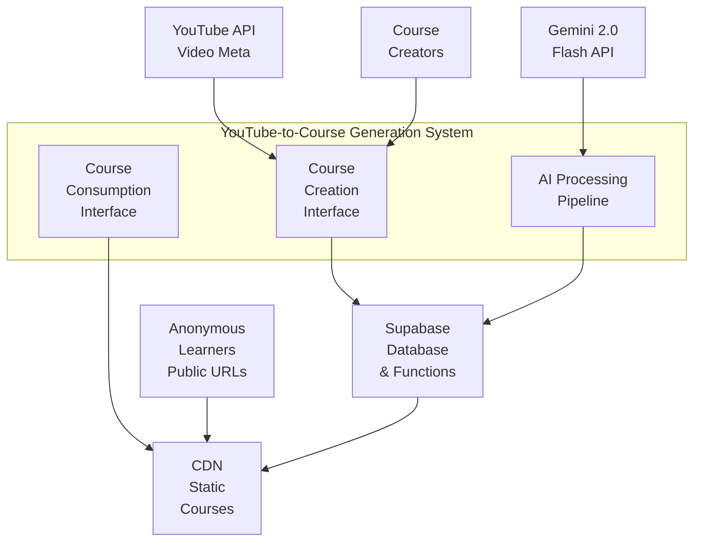
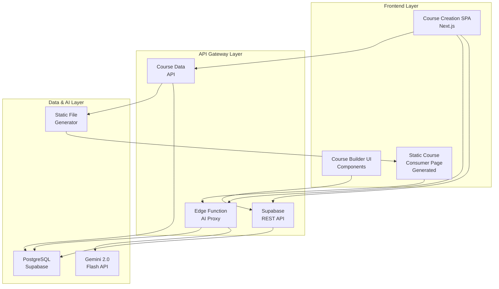
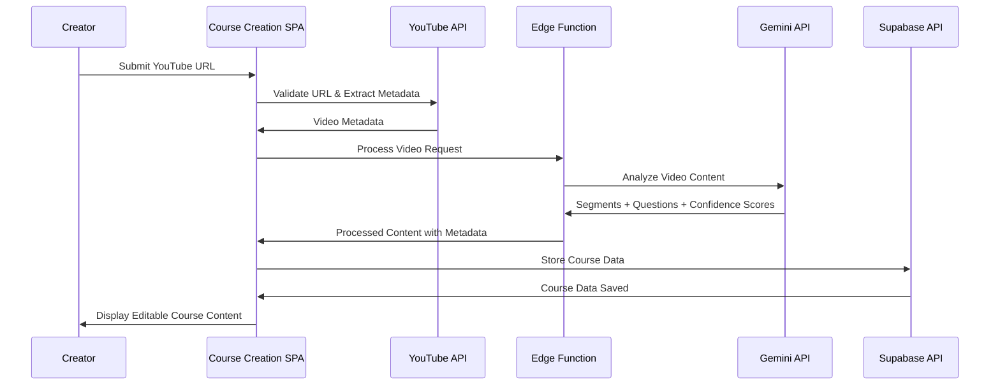
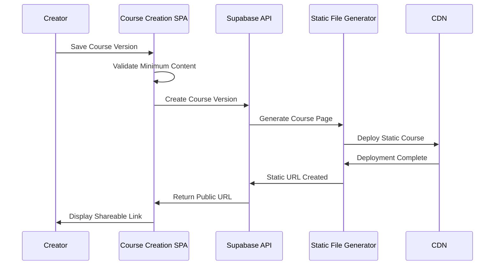
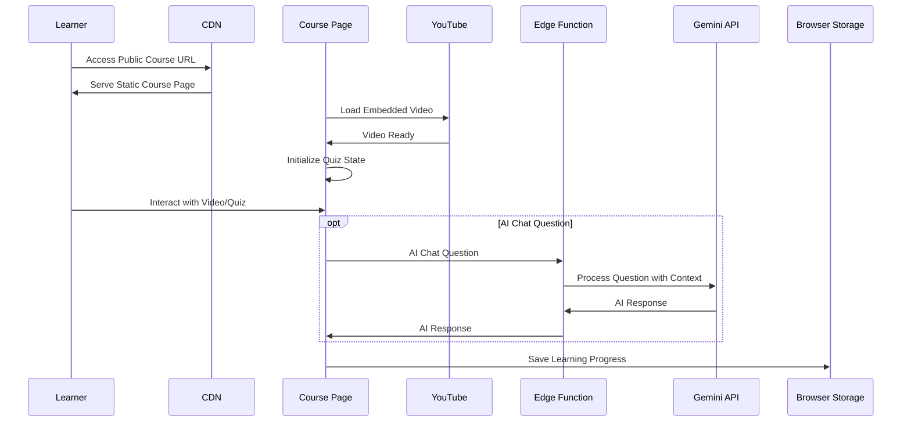
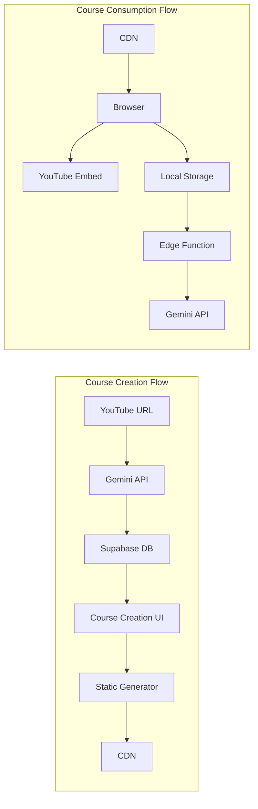
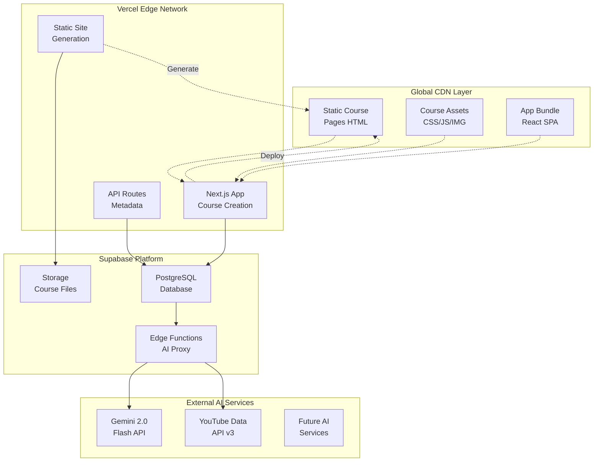

# **System Architecture Document (HLD)**

## **Project: YouTube-to-Course Generation System**

**Version:** 1.0  
**Date:** July 8, 2025  
**Author:** Systems Architecture Team  
**Architecture Pattern:** JAMstack with Serverless Functions

### **1. Introduction**

This System Architecture Document provides the technical blueprint for the YouTube-to-Course Generation System. The system transforms unstructured YouTube video content into structured, interactive learning courses through AI-powered content analysis and question generation. This architecture is designed for MVP scale (hundreds of courses, thousands of learners) with a focus on rapid development, cost efficiency, and seamless user experience.

The system employs a modern JAMstack architecture with Supabase as the backend-as-a-service, Next.js for the frontend application, and Supabase Edge Functions for AI processing. This approach minimizes infrastructure complexity while providing the scalability and performance required for an educational technology platform.

### **2. Architectural Goals and Drivers**

This section explains the architectural decisions driven by the project's Non-Functional Requirements and business constraints.

**Link to NFRs:**
- **Performance NFRs (FR-004, FR-005):** Drive the choice of client-side video processing and CDN-delivered static course pages for sub-2-second load times
- **Scalability NFRs:** Influence the serverless edge function architecture to handle variable AI processing loads without infrastructure management
- **Availability NFRs:** Shape the multi-region Supabase deployment and static asset distribution strategy
- **Security NFRs (FR-002, FR-025):** Drive the anonymous user model with secure course versioning and public URL generation
- **Cost Optimization:** Influences the JAMstack approach to minimize server costs during MVP phase

**Technical Constraints:**
- Must integrate with Gemini 2.0 Flash API for video analysis and question generation
- Must support anonymous users without authentication complexity
- Must generate shareable public course URLs that remain permanently accessible
- Must handle video processing timeouts gracefully (180-second limit per FR-005)
- Must work within Supabase's edge function execution limits (50MB memory, 30-second timeout)

**Business Constraints:**
- MVP budget requires cost-effective serverless architecture
- Development timeline favors pre-built services over custom infrastructure
- Must support rapid iteration and deployment cycles
- Initial scale of hundreds of courses with potential for viral growth

### **3. Architectural Overview & Context Diagram**

**Architectural Pattern:** JAMstack (JavaScript, APIs, Markup) with Serverless Backend
This pattern is optimal for the YouTube-to-Course Generation System because it provides excellent performance through CDN distribution, scales automatically with usage, and maintains cost efficiency during the MVP phase.

**Context Diagram:**

### **4. Component Breakdown and Interaction**

This section decomposes the system into its major logical and physical components, showing how they interact to fulfill the core user journeys.

#### **4.1. Component Diagram**

#### **4.2. Component Responsibilities**

**Course Creation SPA (Next.js Application)**
- Provides the course creation interface for processing YouTube videos
- Handles client-side video player controls and screenshot capture
- Manages course editing state and creator interactions with AI-generated content
- Communicates with Supabase API for data persistence and retrieval

**Course Builder UI Components (React/ShadCN)**
- Implements the atomic design system for consistent user interface
- Provides reusable components for question editing, video segmentation, and confidence score display
- Handles form validation and user input processing
- Manages loading states and error handling for AI processing operations

**Static Course Consumer Page (Generated HTML/JS)**
- Delivers course consumption experience as lightweight static pages
- Embeds YouTube videos with quiz overlay functionality
- Provides AI chat interface for learner questions
- Tracks learning progress in browser local storage

**Supabase REST API**
- Handles CRUD operations for courses, questions, segments, and session data
- Provides real-time subscriptions for collaborative course editing (future feature)
- Manages anonymous user sessions and learning progress tracking
- Enforces data validation and business rules at the database level

**Edge Function (AI Proxy)**
- Processes YouTube video URLs and extracts metadata
- Interfaces with Gemini 2.0 Flash API for video analysis and question generation
- Handles API rate limiting, error handling, and response transformation
- Manages AI chat conversations between learners and the system

**Course Data API**
- Provides specialized endpoints for course version management
- Generates unique public URLs and handles course publishing workflow
- Manages course metadata extraction and storage
- Handles confidence score processing and categorization

**PostgreSQL Database (Supabase)**
- Stores all course data, versions, questions, and learning sessions
- Implements the ERD structure with proper indexing for query performance
- Provides ACID transactions for course version creation and publishing
- Maintains data integrity through foreign key constraints and validation

**Gemini 2.0 Flash API**
- Analyzes YouTube video content to extract concepts and generate segments
- Creates contextual quiz questions with confidence scores
- Processes screenshot-based question generation requests
- Handles AI chat conversations with video context understanding

**Static File Generator**
- Converts course data into optimized static HTML/CSS/JS bundles
- Generates SEO-friendly course pages for public consumption
- Optimizes assets for CDN delivery and fast loading
- Creates immutable course versions with permanent URLs

#### **4.3. Key System Processes - Sequence Diagrams**

**Process 1: Video Processing and Course Creation**

**Process 2: Course Version Publishing**

**Process 3: Learner Course Consumption**

### **5. Data Architecture Overview**

The data architecture follows the detailed Entity-Relationship Diagram provided in the ERD document, with specific optimizations for the MVP scale and JAMstack architecture.

**Data Storage Strategy:**
- **Primary Database:** Supabase PostgreSQL for all persistent course data, user sessions, and analytics
- **Static Assets:** CDN-hosted HTML/CSS/JS files for course consumption pages
- **Temporary Storage:** Browser localStorage for draft course editing and learning progress
- **AI Context:** In-memory processing within edge functions for video analysis

**Data Flow Patterns:**

**Data Consistency Strategy:**
- Course versions are immutable once published, ensuring permanent URL stability
- Draft course data is eventually consistent between browser storage and Supabase
- Learning progress is stored locally with periodic synchronization to Supabase for analytics
- AI-generated content includes confidence scores for quality assessment

### **6. Deployment View**

This section describes the physical infrastructure and deployment topology for the MVP-scale system.

#### **6.1. Deployment Environments**

**Development Environment:**
- Local Next.js development server with hot reload
- Supabase local development environment or dedicated dev project
- Gemini API sandbox/development keys
- Local static file generation for testing

**Staging Environment:**
- Vercel preview deployments for frontend testing
- Supabase staging project with production-like data
- Full AI pipeline testing with rate-limited API access
- CDN testing with non-production domain

**Production Environment:**
- Vercel production deployment with custom domain
- Supabase production project with backup and monitoring
- Production Gemini API keys with full rate limits
- Global CDN distribution for course pages

#### **6.2. Infrastructure Deployment Diagram**

#### **6.3. Technology Stack Details**

**Frontend Stack:**
- **Framework:** Next.js 14 with App Router for optimal performance and SEO
- **UI Library:** React 18 with TypeScript for type safety and developer experience
- **Component System:** ShadCN/UI with Tailwind CSS following atomic design principles
- **State Management:** React Context + useReducer for course creation state
- **Video Player:** YouTube Embed API with custom controls for quiz integration

**Backend Stack:**
- **Database:** Supabase PostgreSQL with Row Level Security for data protection
- **API Layer:** Supabase auto-generated REST API with custom edge functions
- **AI Processing:** Supabase Edge Functions (Deno runtime) for Gemini API integration
- **Authentication:** Anonymous sessions with browser fingerprinting for course ownership
- **File Storage:** Supabase Storage for course assets and generated content

**Infrastructure Stack:**
- **Hosting:** Vercel for Next.js application with automatic deployments
- **CDN:** Vercel Edge Network + Cloudflare for global course page distribution
- **Database Hosting:** Supabase managed PostgreSQL with automatic backups
- **AI API:** Google Cloud Gemini 2.0 Flash with usage-based billing
- **Monitoring:** Vercel Analytics + Supabase Dashboard for system health

**Development Tools:**
- **Version Control:** Git with GitHub for code repository and CI/CD
- **Package Management:** npm with lockfile for dependency consistency
- **Code Quality:** ESLint + Prettier + TypeScript for code standards
- **Testing:** Jest + React Testing Library for unit and integration tests
- **Database Migration:** Supabase CLI for schema version control

### **7. Security and Performance Considerations**

**Security Architecture:**
- Anonymous user model eliminates password security concerns
- Public course URLs use UUIDs to prevent enumeration attacks
- Supabase Row Level Security policies protect course ownership
- Edge functions validate all AI API requests to prevent abuse
- Static course pages contain no sensitive data or API keys

**Performance Optimizations:**
- Static course generation eliminates server-side rendering latency
- CDN distribution ensures sub-2-second global load times
- Client-side video control reduces server API calls
- Edge function caching for repeated AI processing requests
- Database indexing optimized for course lookup and analytics queries

**Scalability Design:**
- Serverless architecture automatically handles traffic spikes
- Static course pages scale infinitely through CDN distribution
- Edge functions distribute AI processing load globally
- Database connection pooling through Supabase handles concurrent users
- Stateless design enables horizontal scaling without session management

This architecture provides a solid foundation for the MVP while maintaining flexibility for future enhancements such as user authentication, advanced analytics, and collaborative course creation features.